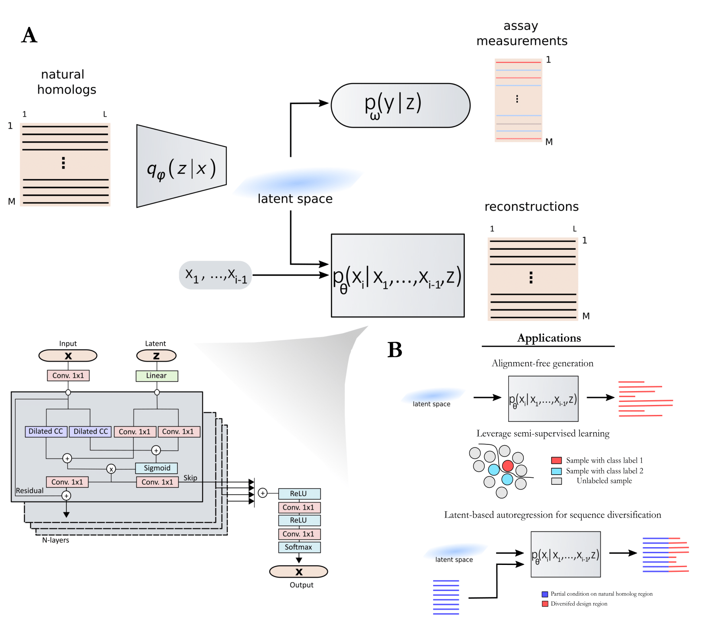

# ProtWaveVAE_model
A fully featured autoregressive (AR) Variational autoencoder (VAE) using a WaveNet decoder for data-driven protein design (ProtWave-VAE).





Altenrative installation can be used too.
```
pip install ProtWave-VAE
```


Using unsupervised ProtWave-VAE.

```python

import torch
import numpy as np
from ProtWave_VAE import model_components, wavenet_decoder, model_ensemble


X = torch.tensor([0, 2, 1, 0]).unsqueeze(0)
# get the number of unique cats
num_categories = len(torch.unique(X))
x_one_hot = torch.nn.functional.one_hot(X, num_categories).float()
print('Input tensor and size:', x_one_hot, x_one_hot.shape)

# encoder hyperparameters
batch_size = x_one_hot.shape[0] # batch size
seq_len = x_one_hot.shape[1] # length of the input sequence
class_labels = num_categories # numer of categorical labels
z_dim = 3 # latent space size
C_in = class_labels
C_out = 128 # convolution layer hidden kernel number
kernel_size = 3 # kernel size for encoder
num_fc = 2 # fully connect layers before embedding latent codes
num_rates = 0 # depth of the encoder convolutions (set to 0 for max depth)

# encoder comp: q(z|x)
encoder = model_components.GatedCNN_encoder(
        protein_len=seq_len,
        class_labels=class_labels,
        z_dim=z_dim,
        num_rates=num_rates,
        alpha=0.1, # leaky ReLU hparam
        kernel=kernel_size,
        num_fc=num_fc,
        C_in=C_in,
        C_out=C_out
)


# wavenet decoder hyperparameters
device = 'cpu' # device = 'cuda' # if GPU is available
whs = 32 # dilated convolution kernel number
hhs = 256 # top model hidden representation size
dec_kernel_size = 3
ndr = 5 # number of dilations (i.e. wavenet depth)

# decoder comp: p(x|z)
decoder_xr = wavenet_decoder.Wave_generator(
                        protein_len=seq_len,
                        class_labels=class_labels,
                        DEVICE=device,
                        wave_hidden_state=whs,
                        head_hidden_state=hhs,
                        num_dil_rates=ndr,
                        kernel_size=dec_kernel_size
)

# latent scaling: z -> Z
latent_upscaler = wavenet_decoder.CondNet(
        z_dim=z_dim,
        output_shape=(1,seq_len)
)


ProtWaveVAE_model = model_ensemble.ProtWaveVAE(
        DEVICE=device,
        encoder=encoder,
        decoder_recon=decoder_xr,
        cond_mapper=latent_upscaler,
        z_dim=z_dim
)


ProtWaveVAE_model.eval()
with torch.no_grad():
    logits_xrc, z, z_mu, z_var = ProtWaveVAE_model(x=x_one_hot)

print('Predicted logits and size:', logits_xrc, logits_xrc.shape)
print('Inferred latent embeddings and size:', z, z.shape)


```


